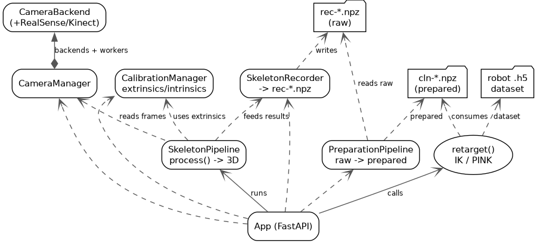

# ViKi — Vision-based Kinematic Imitation

> Video-to-Kinematics for robotics: capture human demonstrations with RGB-D cameras, retarget motions to robots, and generate LeRobot datasets.

ViKi is an open-source pipeline that turns RGB-D video of a human doing a manipulation task into a robot-ready demonstration dataset — no teleoperation rig required.

---

## How it works

```
Human demo (RGB-D video)
        │
        ▼
  Multi-view capture        ← RealSense D435i + Azure Kinect DK
        │
        ▼
  3D skeleton extraction    ← MediaPipe + depth fusion
        │
        ▼
        
  Trajectory optimisation   ← Object-relative IK via PINK / Pinocchio
        │
        ▼
  LeRobot dataset           ← Ready for ACT or Diffusion Policy training
```

---

## Why ViKi?

Teleoperation is expensive, slow, and tied to one robot. Human video is cheap and abundant — but naive retargeting from human to robot kinematics produces noisy, jerky trajectories that hurt policy quality. ViKi closes that gap with trajectory optimisation that respects joint limits, smoothness, and object-relative task structure.

---

## Setup

See [SETUP_GUIDE.md](SETUP_GUIDE.md) for full installation instructions including USB configuration, Docker setup, and multi-Kinect sync wiring.

Quick start:

```bash
sudo ./scripts/host_setup.sh   # run once
docker compose up --build
# open http://localhost:8000
```

The web UI is a plain HTML/CSS/JS page (`viki/server/static/index.html`) served directly
by the FastAPI capture server at `http://localhost:8000/`.

---

## Roadmap

| Phase | Status | Description |
|---|---|---|
| 1 — Capture | ✅ Done | Multi-view RGB-D capture server, per-camera controls, depth streaming |
| 2 — Skeleton | ✅ Done | MediaPipe pose estimation, depth-fused 3D keypoints, multi-view fusion |
| 3 — Smoothing | ✅ Done | One Euro Filter, outlier rejection, smoothness metrics |
| 4 — Retargeting | ✅ Done | URDF IK via PINK/Pinocchio, object-relative cost, gripper inference |
| 5 — Dataset | ✅ Done | LeRobot HDF5 writer, RGB + depth + joints + actions packaging |
| 6 — Evaluation | ⬜ planned | ACT and Diffusion Policy on UR3, naive vs ViKi success rate comparison |

---

## Development

### Running Tests
Unit tests are executed in a dedicated test container to ensure all system dependencies (RealSense/Kinect SDKs) are present:
```bash
docker compose -f docker-compose.test.yml run --rm tests
```

### Project Architecture

See the per-package READMEs for details:

- `viki/capture` ([cameras](viki/capture/README.md)) — camera backend abstractions (RealSense, Azure Kinect) and multi-camera management.
- `viki/calibration` ([calibration](viki/calibration/README.md)) — chessboard/ChArUco intrinsics + per-camera extrinsics.
- `viki/skeleton` ([skeleton](viki/skeleton/README.md)) — MediaPipe pose estimation, depth-fused 3D keypoints, multi-view recording.
- `viki/optimization` ([optimization](viki/optimization/README.md)) — `preparation/` (recorded landmarks → end-effector pose) and `retarget/` (end-effector pose → IK `.h5`).
- `viki/viz` — pure pixel processing (depth colorization, MJPEG encoding, undistortion). No FastAPI/camera/IO dependencies.
- `viki/server` ([server](viki/server/README.md)) — FastAPI app assembly, DI, streaming, and route handlers.

**Layering:** `routes/` (thin handlers) → `deps.py` (DI) → `streams.py` (poll + timing) → `viz/` (pure pixel work) → `config.py` (constants). `viz/` depends on neither FastAPI nor the camera layer, so it is reusable and testable without hardware.

**Data flow:** `CameraManager` owns one `_CameraWorker` (daemon thread) per active camera, each storing the latest frames in a ring buffer under a lock. Stream generators and the skeleton worker *pull* `manager.latest_frame()` independently — there is no push pub/sub.


### The Project's UML Diagrams

