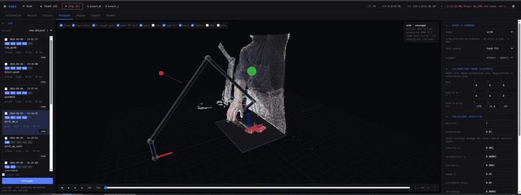

# ViKi — Video-to-Kinematics

> Turn multi-view RGB-D video of a human doing a manipulation task into a
> robot-ready demonstration dataset — no teleoperation rig required.

[](LICENSE)


Human video is cheap and abundant, but naive retargeting from human to robot
kinematics produces noisy, jerky trajectories. ViKi captures the demonstration
from several calibrated RGB-D cameras, reconstructs the hand in 3D, and solves a
whole-trajectory optimisation to land it on a real manipulator.



*The Retarget tab replays a recorded episode as a fused point cloud + hand
skeleton next to the robot arm converging onto the retargeted trajectory.*

---

## 🚧 Project status — read this first

**ViKi is research code under active development. It is not a finished product,
and not everything advertised below is finished.**

- The capture → skeleton → retarget → **trajectory export** path runs end to end.
  That is the v0.0.1 milestone.
- **Accuracy is still being tuned.** Triangulation gating, multi-camera sync and
  the articulated hand-fit model are the subject of ongoing measurement — see
  [`docs/robust_retarget_experiments.md`](docs/robust_retarget_experiments.md).
  There is **no ground-truth reference** in this setup, so all reported
  millimetre figures are self-consistency and tracking-error measures, not
  absolute accuracy.
- **Replay on hardware is a stub.** Nothing exported here has been validated on a
  physical robot. Do not run a ViKi trajectory on real hardware without your own
  review and safety checks.
- **Exported bundles are unscreened.** Because replay is a stub, episodes are
  exported without a replay verdict. Every manifest says so explicitly.
- **Interfaces, defaults and config keys are still moving** between commits.
- **The repository ships code only.** Robot URDFs, model weights, calibration and
  recordings are *not* included — see
  [What you must supply yourself](#what-you-must-supply-yourself).

---

## How it works

```
Multi-view RGB-D capture   ← RealSense D435i + Azure Kinect DK (HW-synced)
        │
        ▼
3D hand skeleton           ← MediaPipe / RTMPose + multi-view triangulation + depth
        │
        ▼
Smoothing & fusion         ← cross-camera fuse, Savitzky–Golay, articulated hand model
        │
        ▼
Robot retargeting          ← whole-trajectory IK via PINK / Pinocchio
        │
        ▼
Trajectory bundle          ← npz + JSON manifest        (works, numpy only)
LeRobot dataset            ← ACT / Diffusion Policy      (needs optional deps)
```

Each stage writes a durable artifact into the episode directory, so any stage can
be re-run, compared or audited on its own:

```
raw/ → rec.npz → cln.npz → plan.h5 → (replay.h5) → dataset
```

---

## Quick start

Everything runs in Docker. The app talks to hardware SDKs (`pyrealsense2`,
`libk4a.so`) that live in the image, not on your host.

```bash
sudo ./scripts/host_setup.sh   # once per host: Docker, udev rules, groups
docker compose up --build      # web UI + API on http://localhost:8000
```

Read [SETUP_GUIDE.md](SETUP_GUIDE.md) **before** plugging in cameras — Azure
Kinect needs a GRUB `usbfs` bump, `xhost +local:`, a separate 10 Gbps USB hub per
device, and a sync cable for multi-Kinect capture.

### Requirements

| | |
|---|---|
| OS | Linux (tested on Ubuntu) |
| Runtime | Docker + Docker Compose |
| GPU | optional; NVIDIA CUDA accelerates the RTMPose backend |
| Cameras | Intel RealSense D435i and/or Azure Kinect DK |
| Robot | a URDF from `robot_descriptions` — UR3/UR5/UR10/UR5e/UR10e, iiwa14 (default: `ur10`) |

You can run the perception stages on pre-recorded episodes with no cameras
attached.

---

## What you must supply yourself

**This repository contains source code only.** `data/` and `models/` are
gitignored, and nothing below is distributed with ViKi. Most of it is fetched or
produced on first use; some of it you have to go and get.

| What | Where it goes | How you get it |
|---|---|---|
| **Robot URDF descriptions** | `models/robot_descriptions/` | Downloaded at the **first retarget run** by the `robot_descriptions` package. Needs network access from inside the container. |
| **Gripper URDFs** | `models/robot_descriptions/` | Same mechanism. Only **Robotiq 2F-85** is wired up; the other profiles refuse to load and state why (licence/packaging unverified). Supplying your own gripper is on you. |
| **Hand-pose model weights** | `~/.cache/`, `models/` | MediaPipe HandLandmarker and RTMPose ONNX **auto-download** on first use. The `mmpose-heatmap` models (HRNetv2, Hourglass-52, SCNet-50, ResNet-50) are **not published as ONNX** — convert them yourself with `mmdeploy` or fetch from the OpenMMLab Deploee, then drop the `.onnx` into `models/`. |
| **Camera calibration** | `data/` | Produced by you, per rig, with the Calibration tab — intrinsics, extrinsics, world anchor. Calibration is rig-specific and varies between recording sessions; none is shipped. |
| **Recordings / episodes** | `data/episodes/`, `data/datasets/` | Yours. Record them with ViKi, or import an existing dataset. |
| **Configuration** | `data/user_configuration.json` | Copied from `default_configuration.json` on first run, then edited by you (robot, base offset, adapter, profiles). |
| **LeRobot export deps** | python env | `pip install viki[export]` — pulls `lerobot` and torch. The native trajectory bundle needs **none** of this. |
| **Host prerequisites** | your machine | GRUB `usbcore.usbfs_memory_mb=1000`, udev rules, X11 access, USB hubs, sync cable — see [SETUP_GUIDE.md](SETUP_GUIDE.md). |

> Third-party models, URDFs and SDKs carry **their own licences**, which are not
> Apache-2.0 and are not granted by this repository. Review them before you
> redistribute anything you build. Open items are tracked in
> [`docs/licensing_todo.md`](docs/licensing_todo.md).

---

## Pipeline stages

| stage | package | status |
|---|---|---|
| record | [`viki/cameras`](viki/cameras/README.md) | works |
| calibrate | [`viki/calibration`](viki/calibration/README.md) | works |
| extract (skeleton) | [`viki/perception`](viki/perception/README.md) | works — accuracy tuning ongoing |
| prepare (fuse + smooth) | [`viki/prepare`](viki/prepare/README.md) | works — accuracy tuning ongoing |
| retarget (IK) | [`viki/retarget`](viki/retarget/README.md) | works |
| replay (hardware validation) | [`viki/replay`](viki/replay/README.md) | **stub** — no hardware validation |
| export → trajectory bundle | [`viki/export`](viki/export/README.md) | works (numpy only) |
| export → LeRobot dataset | [`viki/export`](viki/export/README.md) | partial — needs optional deps; object-relative annotation is a placeholder |

See [`viki/README.md`](viki/README.md) for the full package map and
cross-cutting rules.

### Trajectory export (v0.0.1)

```bash
docker compose run --rm cli export data/episodes/<id> --out data/datasets/pick
```

Produces a self-contained bundle — joint trajectory, commanded and achieved tool
pose, gripper command, the human hand pose it came from, and the per-frame
evidence weight — in plain `.npz` with a JSON manifest that names its units,
frames and provenance. No torch, no parquet, no `lerobot`.

```
<out>/dataset.json                    manifest: schema, units, frames, provenance, index
<out>/episodes/<id>/trajectory.npz    the arrays
<out>/episodes/<id>/meta.json         that episode's provenance
```

The manifest's `screening` field states plainly that nothing was replayed or
vetted. Details in [`viki/export/README.md`](viki/export/README.md).

---

## Usage

The web UI (`viki/server/static/`) is plain HTML/CSS/JS served by FastAPI — no
build step. Tabs: Cameras, Calibration, Record, Extract, Viewer, Retarget,
Export.

The same stages are available headless:

```bash
docker compose run --rm cli record   ...   # capture a synced RGB-D scene
docker compose run --rm cli extract  ...   # raw/  -> rec.npz
docker compose run --rm cli prepare  ...   # rec.npz -> cln.npz
docker compose run --rm cli retarget ...   # cln.npz -> plan.h5
docker compose run --rm cli export   ...   # plan.h5 -> dataset
docker compose run --rm cli run      ...   # extract -> prepare -> retarget -> replay
```

---

## Development

```bash
docker compose run --rm test                           # full test suite
docker compose run --rm test tests/unit_tests/gripper   # a subset (args append to pytest)
docker compose run --rm terminal                        # bash shell in the container
```

`viki/` is bind-mounted, so code edits apply on container restart — no rebuild
unless `pyproject.toml` changes.

### Documentation

| | |
|---|---|
| [`docs/math.md`](docs/math.md) | the full mathematical description of the pipeline |
| [`docs/robust_retarget_experiments.md`](docs/robust_retarget_experiments.md) | measurement protocols and results (E6–E14) |
| [`docs/object_centric_decision.md`](docs/object_centric_decision.md) | why object-relative representation is not built yet |
| [`docs/paper_code_divergences.md`](docs/paper_code_divergences.md) | where the thesis text and the code disagree, and why |
| [`SETUP_GUIDE.md`](SETUP_GUIDE.md) | hardware bring-up, USB, sync wiring |

---

## License

ViKi's source code is licensed under [Apache-2.0](LICENSE). Third-party
dependencies, hardware SDKs, model weights, and robot assets retain their own
terms. See the open [license audit and remediation checklist](docs/licensing_todo.md)
before distributing the application or its Docker image.
