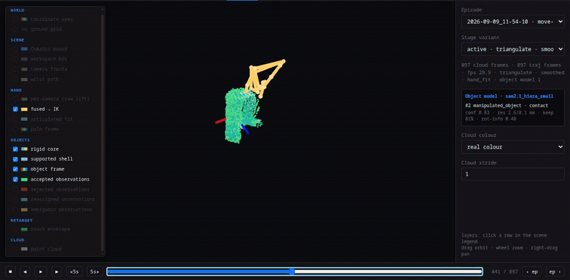

# ViKi v0.0.2 — scene geometry and upper-workspace retarget

`v0.0.2` turns the calibration/cloud investigation and the object-perception
prototypes into auditable pipeline behavior. It does not claim hardware-ready
replay or unconditional object-relative IK.

## Production defaults

- K4A ChArUco bundle adjustment uses exact factory-model camera rays rather
  than mixing a zero-distortion pinhole solve with full-lens depth geometry.
- Mixed depth-edge samples are rejected with a resolution-independent angular
  neighbourhood and a metric discontinuity threshold.
- Exact K4A colour-to-depth projection is enabled for RGB and semantic masks;
  saved empty-scene depth is applied during semantic lift.
- `reference_policy=robot_home` selects the conservative upper-workspace IK
  branch by default. The previous `zero` reference remains available.

## Scene-perception pipeline

The former standalone commands are now one resumable episode branch:

```text
raw RGB-D
  → automatic or supplied prompts
  → SAM 2.1 instance masks
  → calibrated semantic 3-D cloud
  → compact rigid core/shell models and pose/confidence tracks
```

Run it alone with `docker compose run --rm sam2 scene <episode> --objects N`,
or add it to the complete pipeline with
`docker compose run --rm sam2 run <episode> --scene-objects N`.

`status.json` records `segment` and `object_model`. A completed
`object_models.npz` is copied into the dependency-free trajectory bundle as an
optional sidecar. Retarget does not consume it implicitly: the measured object
orientation failures still require per-DOF observability and contact gating.



## Retarget runtime

The solver previously performed an exact full-trajectory self-collision sweep
immediately after obtaining the same exact margins during collision
linearisation. It also allocated fresh Pinocchio/Pink data for every collision
query.

`v0.0.2` reuses dedicated collision data and carries the current exact margin
out of linearisation. Candidate steps and the final result retain independent
exact full-trajectory checks.

On the same 150-frame, six-iteration `pyramid` profile on the project host:

| | Before | v0.0.2 |
|---|---:|---:|
| wall time | 53.423 s | 37.270 s |
| Pink collision configuration updates | 3,010 | 2,110 |
| relative change | — | **−30.2%** |

This optimization does not subsample frames, reduce collision pairs, loosen
the barrier, or change the QP.

## Full-rate recorded-scene regression

The final solver was rerun without frame subsampling on two 30-second recorded
episodes after the runtime change:

| episode | frames | status / iterations | observed position RMSE | observed orientation RMSE | floor / collision margin | wrist above target |
|---|---:|---|---:|---:|---:|---:|
| `move-shipok` | 897 | converged / 21 | 7.29 mm | 15.53° | 38.29 / 7.42 mm | 100.0% |
| `pyramid` | 898 | converged / 19 | 31.82 mm | 74.53° | 0.0028 / 39.30 mm | 81.6% |

These are regression measurements, not hardware approval. In particular,
`pyramid` still has sparse pose support and a badly constrained orientation;
the result is retained here rather than presenting convergence as accuracy.

The rebuilt release images passed the complete hardware-independent suite:
`311 passed, 3 skipped`.

## Known limits

- Replay remains a stub and no trajectory has been validated on hardware.
- The current top-side hand-to-tool mapping is suitable as a conservative
  pick-and-place default, not a universal pouring policy.
- SAM/object pose metrics are self-consistency measurements without labelled
  pose ground truth.
- Environment/cloud collision, a measured per-episode table plane and hard
  acceleration/jerk limits remain future work.
